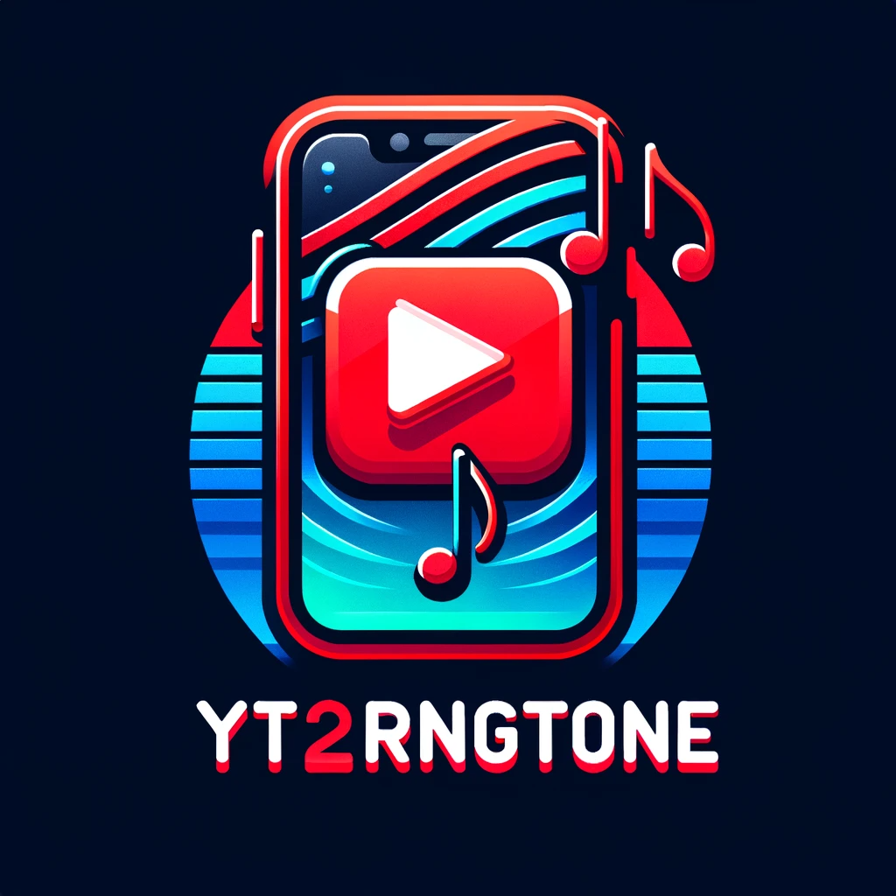

# 🎶 YouTube to iPhone Ringtone Converter 📱



This script allows you to convert any YouTube video into an iPhone ringtone format (`.m4r`). It's easy to use and requires only a simple Python setup. Follow the steps below to get started!

## Prerequisites

Before you begin, make sure you have the following installed:
- **Python 3:** The script is written for Python 3. [Download Python](https://www.python.org/downloads/)
- **Required Libraries:** The script uses `pytube` for downloading YouTube videos and `moviepy` for audio processing.
  - Install them using pip:
    ```bash
    pip install pytube moviepy
    ```

## Installation

1. **Clone or Download the Script:**
   - Use `git` to clone the repository or simply download the script file to your local machine.
     ```bash
     git clone https://your-repository-url.git
     ```
   - If you downloaded the script, make sure it's in a convenient directory.

2. **Navigate to the Script Directory:**
   - Open your terminal or command prompt.
   - Navigate to the directory where you have saved the script.
     ```bash
     cd path/to/your/script
     ```

## Usage

1. **Run the Script:**
   - In your terminal or command prompt, run:
     ```bash
     python script_name.py
     ```
   - Replace `script_name.py` with the actual name of your script file.

2. **Enter the YouTube URL:**
   - The script will prompt you to enter the URL of the YouTube video you want to convert.
   - Simply paste the URL and press enter.
     ```
     Enter the YouTube video URL: [Paste your YouTube link here]
     ```

3. **Find Your Ringtone:**
   - Once the script finishes running, it will save the converted ringtone in the same directory.
   - The script will notify you of the ringtone file's name.

## 🌟 Features

- **Easy to Use:** Simple interface, just paste the YouTube link.
- **Fast Conversion:** Quick download and conversion process.
- **Custom Ringtones:** Create personalized ringtones for your iPhone.

## 📋 Note

- Ensure you have legal rights to download and convert the YouTube video.
- The script currently does not support selecting specific portions of the video for conversion. It converts the entire audio of the video.

## 🤝 Contributing

Contributions, issues, and feature requests are welcome! Feel free to check [issues page](https://github.com/your-repository-url/issues).

## ⭐ Show your support

Give a ⭐️ if this project helped you!
